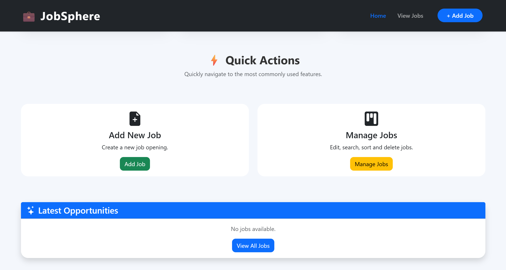
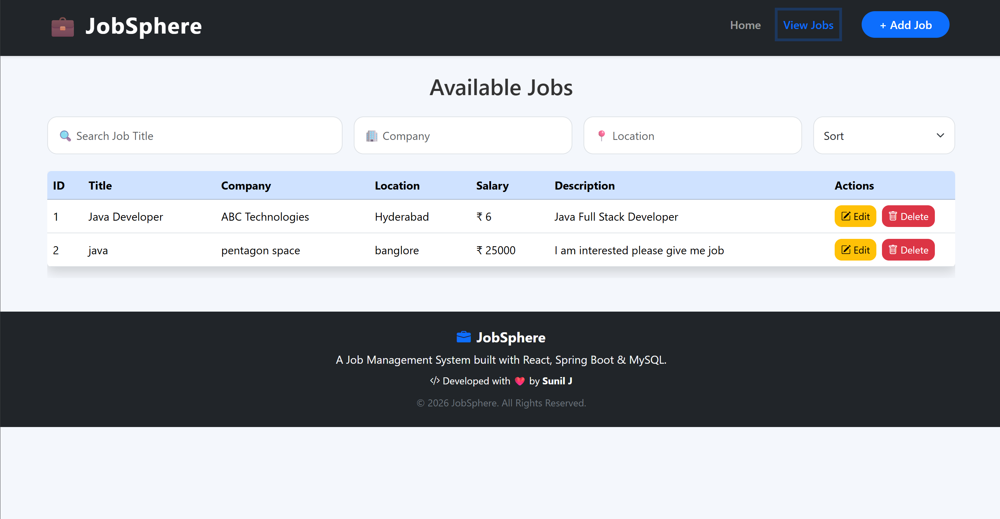
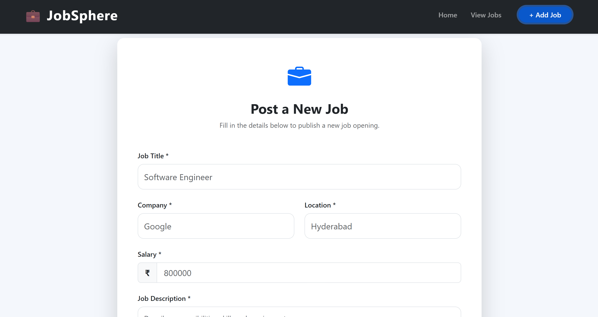
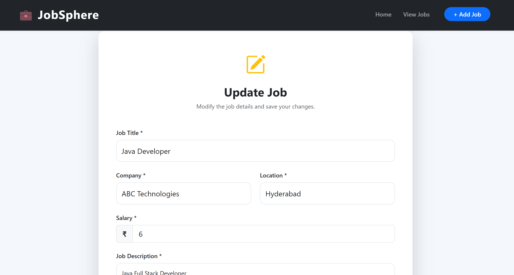

# 💼 JobSphere - Full Stack Job Portal

A modern **Full Stack Job Portal** built using **React, Spring Boot, and MySQL**. JobSphere allows users to create, manage, update, search, sort, and delete job listings through a clean, responsive, and user-friendly interface.

---

## 🌐 Live Demo

**Frontend:** https://jobsphere-ai-psi.vercel.app

**Backend API:** https://jobsphere-ai-qfsv.onrender.com/api/jobs

---

## 📸 Application Screenshots

### 🏠 Home Page




---

### 💼 View Jobs



---

### ➕ Add Job



---

### ✏️ Edit Job



---

## 🚀 Features

- Create New Job Listings
- Update Existing Jobs
- Delete Jobs
- Search Jobs by Title
- Sort Jobs by Title, Company and Salary
- Dashboard Statistics
- Recent Jobs Section
- Responsive User Interface
- Form Validation
- Toast Notifications
- Loading Spinner
- Delete Confirmation Dialog
- REST API Integration

---

## 🛠 Tech Stack

### Frontend

- React
- React Router DOM
- Axios
- Bootstrap 5
- Bootstrap Icons
- React Toastify
- Vite

### Backend

- Java 24
- Spring Boot
- Spring Data JPA
- Maven

### Database

- MySQL (Railway)

### Deployment

- Vercel (Frontend)
- Render (Backend)
- Railway (Database)
- GitHub

---

## 📁 Project Structure

```text
JobSphere
│
├── Backend
│   ├── src
│   ├── pom.xml
│   └── application.properties
│
├── frontend
│   ├── src
│   ├── public
│   ├── package.json
│   └── vite.config.js
│
├── screenshots
│   ├── home-1.png
│   ├── home-2.png
│   ├── jobs.png
│   ├── add-job.png
│   └── edit-job.png
│
└── README.md
```

---

## ⚙ Installation

### Clone Repository

```bash
git clone https://github.com/Sunil20033/jobsphere-ai.git
```

### Backend

```bash
cd Backend
./mvnw spring-boot:run
```

### Frontend

```bash
cd frontend
npm install
npm run dev
```

---

## 📌 API Endpoints

| Method | Endpoint | Description |
|---------|----------|-------------|
| GET | `/api/jobs` | Get all jobs |
| GET | `/api/jobs/{id}` | Get job by ID |
| POST | `/api/jobs` | Create a new job |
| PUT | `/api/jobs/{id}` | Update a job |
| DELETE | `/api/jobs/{id}` | Delete a job |

---

## 🌟 Future Improvements

- User Authentication
- Role-Based Access
- Company Logos
- Job Categories
- Advanced Filters
- Pagination
- Email Notifications

---

## 👨‍💻 Developed By

**Sunil J**

Java Full Stack Developer

GitHub: https://github.com/Sunil20033

---

## ⭐ Support

If you found this project useful, consider giving it a **Star ⭐** on GitHub.

It helps others discover the project and supports my work.
